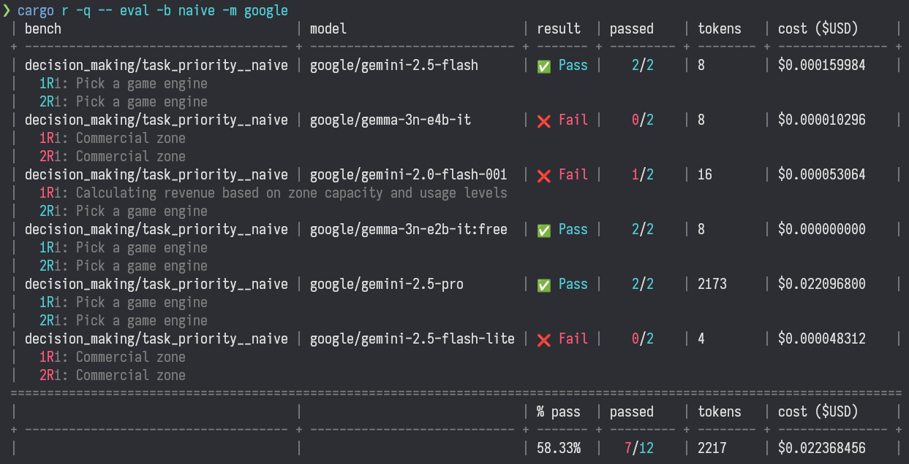

# LLM Bench

A simple CLI tool for benchmarking Large Language Models via the [OpenRouter](https://openrouter.ai/) API. It sends predefined prompts to various models, evaluates the responses against expected outcomes, and reports pass/fail rates along with token usage and costs.

## Notes

This is an experimental application created for my own personal use to iterate on different prompt styles. It doesn't include many benchmarks (PRs welcome).

## Features

- Run benchmarks on multiple models and tasks concurrently.
- Filter and select specific benchmarks or models.
- Doesn't re-run completed tasks.
- Evaluate responses with pluggable evaluators.
- Output scores filtered by bench or model.

## Installation

Only source installation is currently supported.

1. Install Rust if not already: [rustup.rs](https://rustup.rs)
2. Clone the repo and build:

   ```
   git clone <repo-url>
   cd llmbench
   cargo build --release
   ```

3. Add to `$PATH` or use `cargo run`

## Configuration

**NOTE**: All models are commented out in the config file to avoid accidental costs. You _must_ edit the file for the tool to work.

The config file comes pre-loaded with some of the models available on OpenRouter at the time of publishing.

Update the `config.toml` with the models that you are interested in testing. `llmbench` runs the benchmark against all models listed unless a CLI flag is used to bench a specific model. Model IDs are from [the model list](https://openrouter.ai/models) at OpenRouter:

```toml
models = [
    "anthropic/claude-sonnet-4.5",
    "deepseek/deepseek-chat-v3.1",
    "google/gemini-2.5-pro",
    "meta-llama/llama-4-maverick",
]
```

- Set `OPENROUTER_API_KEY` environment variable for authentication. See the `.env.example` file.

Note that free models will get rate-limited and aren't suitable for running multiple benches nor multi-turn benches.

## Usage

### Benchmarking

Run all benchmarks on all models (defaults to 3 runs per model per benchmark):

```
cargo run --release -- bench
```

Run specific benchmarks and models:

```
cargo run --release -- bench -m "x-ai/grok-4" -m "qwen/qwen3-coder" --n-runs 2 task_priority__naive 
```

### Evaluation

Evaluate all results:

```
cargo run --release -- eval
```

Evaluate results, filtering by model and bench:

```
cargo run --release -- eval -m "gpt-4o-mini" -b task_priority__naive
```

#### Output

Running `eval` prints a table like:



Color coding is used for pass/fail: cyan for pass, red for fail.

The output is split into two major sections:
1. The benchmark information including: name, model, result, pass/fail, response tokens, cost
2. Responses from the LLMs

The response section displays the responses from the LLMs using this format:

```
<run #>R<turn #>: <response>
```

For example, if a benchmark has been ran twice for a specific model, you'll see output like this:

```
1R1: <output from the first run>
2R1: <output from the second run>
```

For multi-turn benchmarks, the output looks like this:
```
1R1: <output from first prompt, run 1>
1R2: <output from second prompt, run 1>
2R1: <output from first prompt, run 2>
2R2: <output from second prompt, run 2>
```

You will see multi-turn responses marked as failed when _any part_ of benchmark fails. The model needs to get each step correct in order to pass.

## Adding Benchmarks & Evaluators

Benchmarks and evaluators exist in the same benchmark module for organizational purposes. It's recommended to copy an existing benchmark to start with and then modify the relevant parts.

Benchmark files have two submodules: `bench` and `eval`. Registration of the benchmark and evaluator both use a [distributed slice](https://docs.rs/linkme/latest/linkme/struct.DistributedSlice.html), so there is no need to change any other code when adding a new benchmark.

Here is a minimal example of a bench+evaluator:

```rust
const ID: &str = "example/foo";

mod bench {
    use super::ID;
    use crate::feat::bench::prelude::*;

    register_bench!(run);

    async fn run(
        api: Arc<OpenRouter>,
        ctx: BenchCtx,
    ) -> Result<BenchResult, Report<CompletionError>> {
        let bench = BenchId(ID.to_string());
        let mut result = BenchResult {
            hash: ctx.run_hash,
            bench: bench.clone(),
            model: ctx.model.clone(),
            requests: vec![],
            responses: vec![],
        };

        let request = PromptRequest::builder()
            .model(ctx.model.to_string())
            .messages(vec![user_message(PROMPT)])
            .build()
            .save_to(&mut result);

        let _ = complete(&api, request.clone(), &ctx.model, &bench)
            .await?
            .save_to(&mut result);

        Ok(result)
    }

    const PROMPT: &str = r#"Reply with the word "foo" without quotes and without additional comment"#;
}

mod eval {
    use super::ID;
    use crate::feat::bench::prelude::*;

    register_eval!(eval);

    fn eval(responses: &[Choice]) -> Score {
        match responses {
            [a] => match a.get_message() {
                Some(a) => {
                    let answer = a.lowercase().remove_chat_tags().alphanumeric_only().trim()
                        == "foo";
                    Score::builder().pass(answer).build()
                }
                _ => Score::fail(),
            },
            _ => Score::fail(),
        }
    }
}
```

There are a handful of helper functions provided in the [helper.rs](src/feat/bench/helper.rs) file.

## TODO

- [ ] Add more benchmarks
- [ ] Use pass/fail colors for individual turns on multi-turn evaluations (instead of all red if any turn fails)
- [ ] Sort output
- [ ] Display more statistics in the summary line like average or median
- [ ] Save evaluation results instead of re-running the evaluators each time
- [ ] Less code to create benchmarks and evaluators.
- [ ] Easy way to add "1 prompt, 1 answer" benchmarks.
- [ ] Different storage backends

## License

[GNU GPLv3](https://www.gnu.org/licenses/gpl-3.0.txt)
